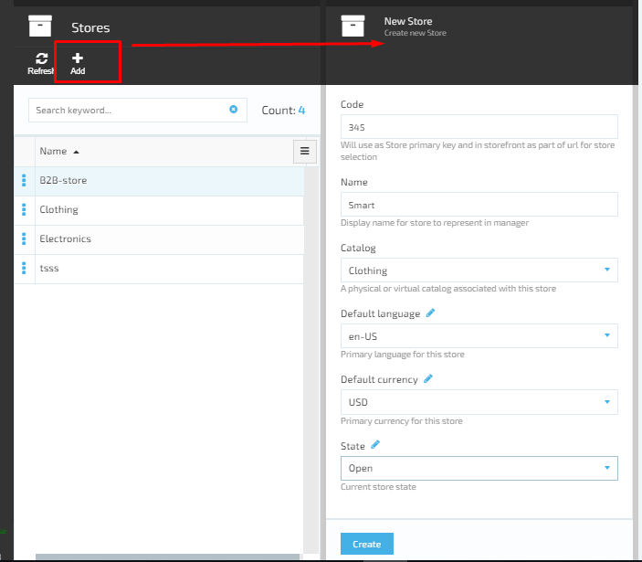
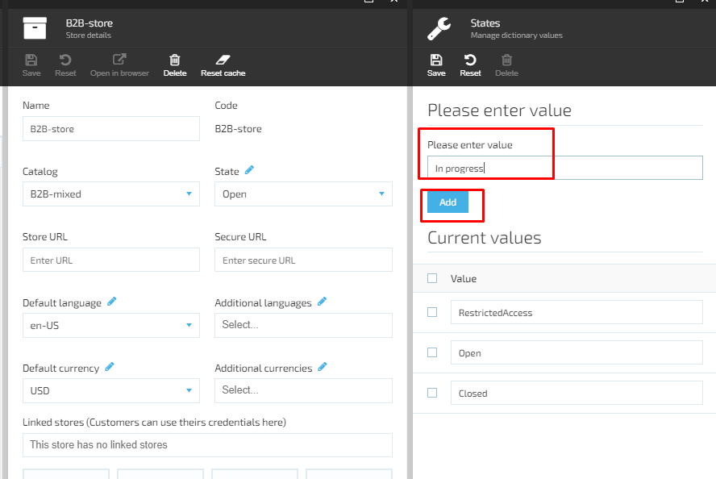
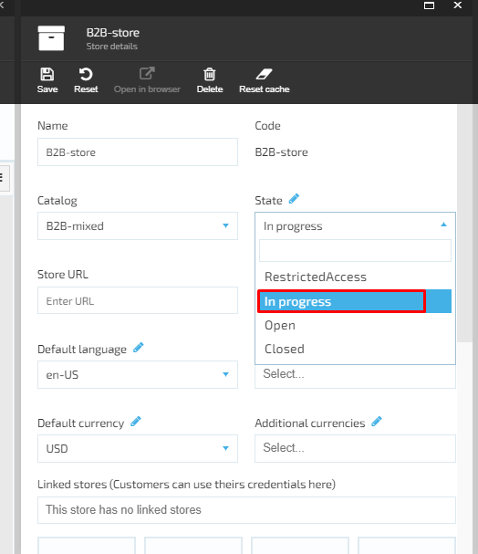
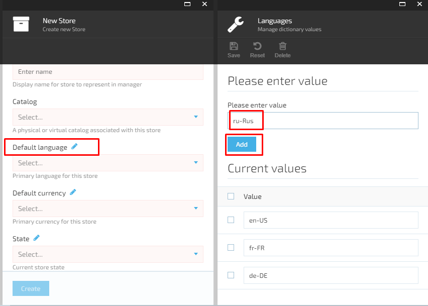
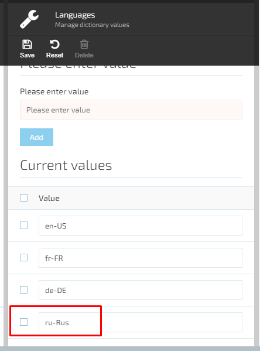
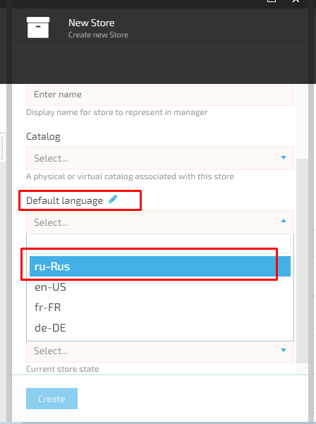
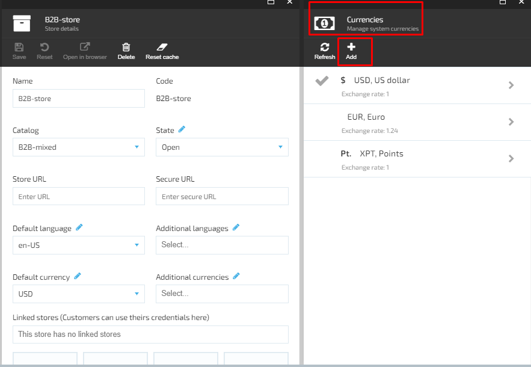
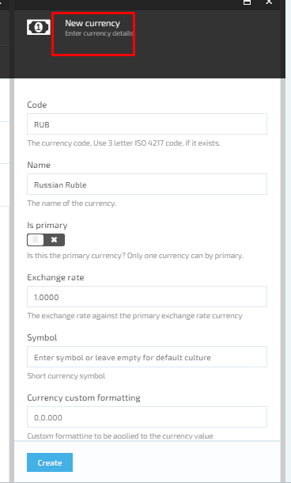
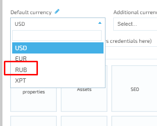

# Add New Store

The user can add as many new stores as necessary using. In order to add a new store using VirtoCommerce platform, the user should go through the following steps:

1. The user opens the ‘Stores’ Module and clicks the ‘Add’ button;
1. The system will display the ‘New Store/create new store’ blade:
     1. ‘Code’ - required field. This code is used as store primary key and on storefront as a part of the URL for store selection;
     1. ‘Name’- required field. The Store name is displayed fore representing the Store in Manager;
     1. ‘Catalog’ drop down – required. Physical or virtual catalog associated with this store;
     1. ‘Default Language’ drop down- required. Primary language for the store;
     1. ‘Default currency’ drop down – required. Primary currency for this store;
     1. ‘State’ drop down- required. Describes the current store state;
     1. ‘Create’ button is disabled by default.
1. The user fills out the form and clicks the ‘Create’ button;
1. The system will create the new store and display it on the ‘Stores’ blade.

## Add State

The system displays three states in the drop down that the user can selects: Restricted Access, open, closed. These are default values provided out-of-the-box. If the user wants to add a new state, he should go through the following steps:

1. Select ‘State’ and click on the ‘Edit’ icon;
1. The ‘Manage dictionary values’ screen will be displayed:  

     1. ‘Please enter value’ field- required;
     1. ‘Add’ button is disabled until the value is added;
     1. List of current values.
1. The user enters the value name and clicks the ‘Add’ button;
1. The new value will be added to the current values list;
1. The user clicks ‘Save’ to save the changes;
1. The new value will be saved and displayed in the drop down.

## Add Language

1. Select ‘Default language’ and click on the ‘Edit’ icon;
1. The ‘Manage dictionary values’ screen will be displayed:  

     1. ‘Please enter value’ field- required;
     1. ‘Add’ button is disabled until the value is added;
     1. List of current values;
     1. The user enters the value name and clicks the ‘Add’ button;
     1. The new value will be added to the current values list.  
1. The user clicks ‘Save’ to save the changes;
1. The new language will be saved and displayed in the drop down.

## Add Default Currency

In order to add a default currency to the list, the user should do the following:

1. Select the currency and click on the ‘Edit’ button;
1. The system will display the ‘Manage currencies’ blade with possibility to add a new currency or delete the existing ones;
1. The user clicks the ‘Add’ button to add one more currency;
1. The system will open the ‘New currency’ blade:

     1. ‘Code’ field- required. The user should enter the currency code;
     1. ‘Name’ field- required. The user should enter the currency name;
     1. ‘Is primary’ button;
     1. ‘Exchange rate’ field;
     1. ‘Symbol’ field;
     1. ‘Currency custom formatting’ field;
     1. ‘Create’ button is disabled by default.  
1. The user fills out the form and clicks the ‘Create’ button;
1. The system will create the new currency and display it on the list;
1. The new currency will be displayed in the drop down under ‘Default currency’.
1. In order to select a default currency that will be displayed on the store, the user should switch on the ‘Is primary’ button on ‘Edit currency details screen.
 
[

