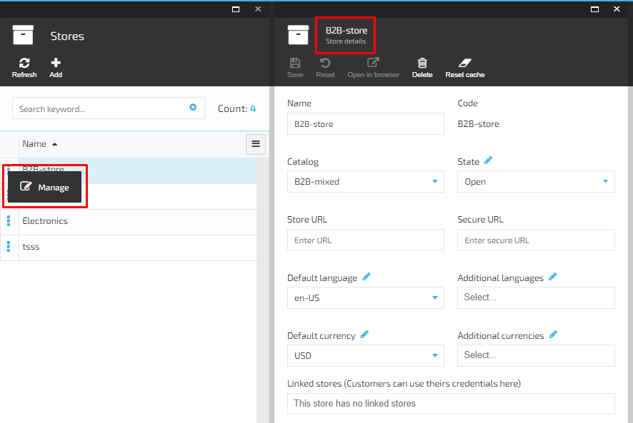
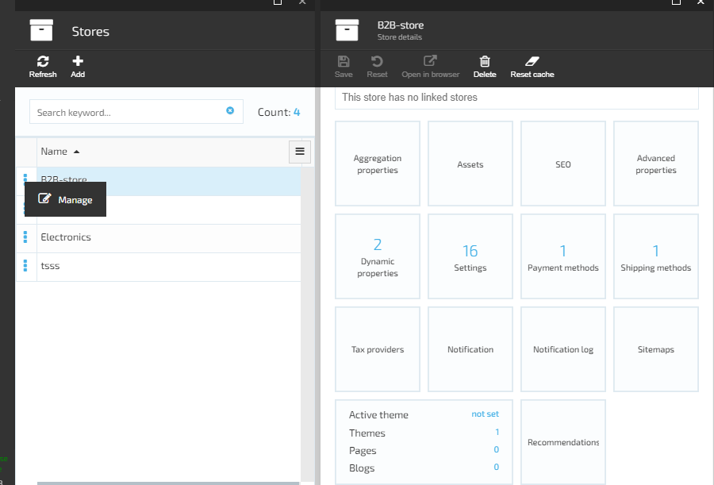

# Edit Store Details

1. The user selects the store on ‘Stores’ blade and clicks ‘Manage’;
1. The system will open the store details screen in editable format;
     1. The Store code field is not editable;
1. The user makes the changes and clicks the ‘Save’ button;
1. The system will save the changes and display the updated store on the ‘Stores’ blade.

