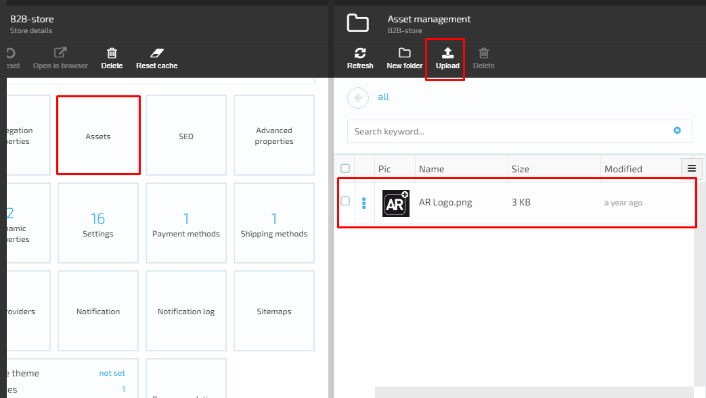

# Widgets

## Advanced Properties

### Edit Advanced Properties

1. The user clicks on the ‘Advanced properties’ widget;
1. The system will open the ‘Advanced properties’ screen and display the following fields and elements:  

     1. ‘Description’ text box;
     1. ‘Store country’ drop down;
     1. ‘Store region’ input field;
     1. ‘Store email’ input field;
     1. ‘Store admin email’ input field;
     1. ‘Default fulfillment center’ drop down;
     1. ‘Available fulfillment centers’ drop down;
     1. ‘Default returns fulfillment centers’ drop down;
     1. ‘Available returns fulfillment centers’ drop down;
     1. ‘Operational timezone’ drop down;
     1. ‘OK’ and ‘Cancel’ button.
1. The user fills out the fields;
1. All fields are optional. The user is allowed to keep the ‘Advanced properties’ widget empty or fill out just some of the fields.  
1. The user clicks the ‘OK’ button;
1. The system will save the changes and close the blade.

## Assets

### Edit Assets

1. The user selects the ‘Assets’ widget and clicks on it;
1. The system will display the ‘Asset management’ screen;
     1. A table with the list of assets is displayed;
     1. Buttons:
         1. Refresh- always enabled;
         1. Upload- always enabled;
         1. New folder- always enabled;
         1. Delete- disabled if no asset is selected.  
1. The user clicks the ‘Upload’ button;
1. The system will open the ‘Upload asset’ screen;
1. The user will be prompted to drag and drop files;
1. The user drags and drops the file he wants to upload;
1. The system will display the new asset on the ‘Asset Management’ screen.

## Settings

The system displays the default settings, when the store is just created. All settings are editable.

### Edit Settings

1. The user selects the ‘Settings’ widget and clicks on it;
1. The system will display the ‘Settings’ screen. All fields on the screen are preset and editable;
1. The user makes the changes he needs and clicks the ‘OK’ button;
1. The system will save the changes and close the blade.

## Payment Methods

The Payment methods in Store Module are hardcoded and can not be edited on the UI. In order to view the payment methods, the user should select the 'Payment methods' widget and click on it. The system will display the payment methods available.

## Shipping Methods

The Sipping methods in Store Module are also hardcoded and can not be edited on the UI. In order to view the shipping methods, the user should select the 'Shipping methods' widget and click on it. The system will display the shipping methods available.

## SEO

1. In order to add new SEO or edit the existing one, the user should select the 'SEO' widget and click on it;
1. The system will display the 'Manage SEOs' screen
      1. If SEO was added before, the data will be displayed
      1. If no SEO was previously added, the screen will be empty;
      1. 'Add' button is always active.
1. The user clicks the 'Add' button
1. The system will open the 'New SEO' screen
      1. 'Is Active' button;
      1. 'Language' drop down- select language;
      1. 'URL keyword' field- required;
      1. 'Page title' field;
      1. 'Meta description' text box;
      1. 'Image alternative text' field
      1. Buttons: 'OK', 'Cancel'
1. The user fills out the form and clicks the 'OK' button
1. The new SEO will be created and data displayed on 'Manage SEOs' screen.

## Tax Providers

### View and edit tax providers

The tax providers are pre-defined and can be only edited. New tax providers can not be added on UI.

1. The user opens the 'Store details' screen and clicks on the 'Tax Providers' widget;
1. The system will display the 'Tax providers' screen

1. The user clicks on the Tax provider displayed on the screen
1. The system opens the 'Edit tax provider' blade:
       1. Description tax box (example, fixed tax rate)
       1. Settings:
             1. 'Fixed tax rate %' field.
       1. Buttons:
             1. 'OK'
             1. 'Cancel'
1. The user enters the description and tax rate and clicks the 'OK' button
1. The system will save the changes and display the description on the 'Tax providers' screen.

## Dynamic Properties

The user can manage the existing dynamic properties or add new properties to the Store Module.

### View Add New Dynamic Property

1. The user selects the Dynamic Properties widget and clicks on it;
1. The system will display the 'Edit properties values' screen:

1. The 'DefaultThemeName' field and 'FilteredBrowsing' text box are both editable;
1. The 'OK' and 'Cancel' buttons are always active.

### Edit Dynamic Properties

1. The user selects a dynamic property from the list on 'Manage dynamic properties' screen and clicks on it;
1. The system will display the 'Manage property' screen in editable format;
1. The user edits the existing data and clicks the 'Save' button;
1. The system will save the changes and display the edited property.

### Add New Property

1. The user clisks the 'Add' button on 'Manage dynamic properties' screen;
1. The system will display the 'New property screen';
1. The user fills out the form and clicks the 'Create' button;
1. The new property will be created and displayed on 'Manage dynamic properties' screen.

## Notifications

### View Notification Templates

Notifications widget helps the user to set up different types of notifications for the Store Module. A certain set of notification templates is provided out-of-the-box. However, the system allows the user to add new notification templates in case of need.

In order to view the existing notification templates, the user should select the 'Notifications' widget and click on it. The system will open the 'Notification types list' screen.

The full list of provided notification templates can be seen on the screenshots bellow:

### Create Notification Template

1. The user selects a notification type from the Notification types list and click on it;
1. The system will display the 'Notification Templates' screen with an active 'Add' button;
1. The user clicks 'Add';
1. The system will open the 'Create Notification Template' screen. The template is in editable format;
1. The user makes the changes and clicks the 'Create' button
1. The new template will be created and displayed on 'Notification templates' screen.

